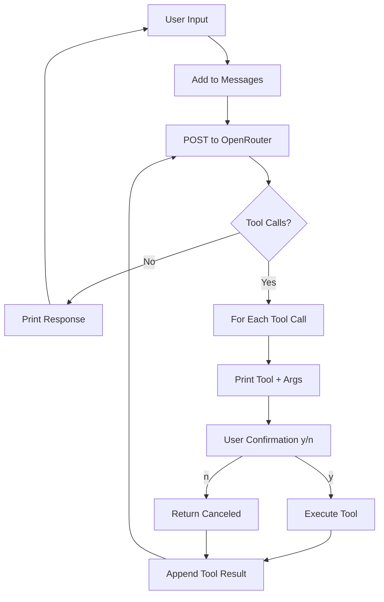

# Nemo Agent

> **A minimalist, tool-augmented AI agent that lives in your terminal.** Built for developers who want a capable coding companion without the bloat.

---

## ✨ What is Nemo?

Nemo is a lightweight, open-source AI agent that runs in your terminal and can **actually do things**—read files, write code, run commands, and explore your codebase. It's powered by any OpenRouter-compatible model and designed with a "human-in-the-loop" philosophy: every action requires your explicit approval.

Think of it as a pair programmer who asks before they type.

---

## 🎯 Key Features

| Feature | Description |
|---------|-------------|
| 🔐 **Explicit Confirmation** | Every file read, write, and command execution requires your `y/n` approval |
| 🛠️ **Four Core Tools** | `list_files`, `read_file`, `write_file`, `run_command` — everything you need |
| 🤖 **Model Agnostic** | Works with any model on OpenRouter (GPT-4, Claude, Llama, etc.) |
| 💬 **Conversational Loop** | Multi-turn conversations with tool use — maintains full context |
| 📦 **Zero Dependencies** | Only `requests` and `python-dotenv` — installs in seconds |
| 🔧 **Extensible** | Add new tools in ~10 lines of code |

---

## 🚀 Quick Start

### Prerequisites

- Python 3.10+
- An [OpenRouter API key](https://openrouter.ai/keys)

### Installation

```bash
# Clone the repository
git clone https://github.com/Minimelist/nemo-agent.git
cd nemo-agent

# Create a virtual environment (recommended)
python -m venv .venv
source .venv/bin/activate  # On Windows: .venv\Scripts\activate

# Install dependencies
pip install requests python-dotenv
```

### Configuration

Create a `.env` file in the project root:

```env
# Required: Your OpenRouter API key
ORAPI=sk-or-v1-xxxxxxxxxxxxxxxxxxxxxxxx

# Optional: Model to use (default: openrouter/auto)
# See https://openrouter.ai/models for available models
MODEL=anthropic/claude-3.5-sonnet
```

> **Tip:** The `openrouter/auto` model routes to the best available model for your task. For coding, `anthropic/claude-3.5-sonnet` or `openai/gpt-4o` are excellent choices.

### Run Nemo

```bash
python agent.py
```

You'll see:

```
Welcome to Nemo Agent! Type 'exit' or 'quit' to end the session.
You: 
```

Start chatting! Try: *"List the files in the current directory"* or *"Create a hello world Python script."*

---

## 💡 Usage Examples

### Explore a Codebase

```
You: What files are in the src directory?
Nemo wants to run tool: list_files({"path": "src"})
Do you want to list files in the directory src? (y/n): y
Nemo Agent: Here are the files in src/
main.py
utils/
  helpers.py
  config.py
```

### Read and Understand Code

```
You: Read the main.py file and explain what it does
Nemo wants to run tool: read_file({"path": "src/main.py"})
Do you want to read the file at src/main.py? (y/n): y
Nemo Agent: This file is the entry point for the application...
```

### Write Code

```
You: Create a new file called greet.py with a function that greets a user by name
Nemo wants to run tool: write_file({"path": "greet.py", "content": "def greet(name):\n    return f'Hello, {name}!'\n\nif __name__ == '__main__':\n    print(greet('World'))"})
Do you want to write to the file at greet.py? (y/n): y
Nemo Agent: Successfully wrote to greet.py with 87 characters.
```

### Run Commands

```
You: Run the greet.py script to test it
Nemo wants to run tool: run_command({"command": "python greet.py"})
Do you want to run the command: python greet.py? (y/n): y
Nemo Agent: Hello, World!
```

### Complex Multi-Step Tasks

```
You: Refactor the utils/helpers.py file to add type hints and docstrings to all functions
```

Nemo will:
1. Read the file
2. Analyze the code
3. Write the improved version
4. Optionally run tests/linters if you ask

---

## 🏗️ Architecture

```
agent.py
├── TOOLS                    # Dictionary of executable functions
│   ├── list_files(path)     # List directory contents
│   ├── read_file(path)      # Read file contents
│   ├── write_file(path, content)  # Write file contents
│   └── run_command(command) # Execute shell commands
│
├── TOOLS_SCHEMAS            # OpenAI-compatible function schemas for the LLM
│
├── run_tool(tool_call)      # Dispatches tool calls with logging
│
├── run_agent(messages)      # Main agent loop:
│   ├── POST to OpenRouter   #   1. Send messages + tools
│   ├── Parse response       #   2. Get assistant message (+ tool_calls)
│   ├── Execute tools        #   3. Run each tool (with user confirmation)
│   └── Append results       #   4. Feed tool results back to model
│
├── SYSTEM_PROMPT            # Agent identity & tool descriptions
│
└── main()                   # CLI entry point: REPL loop
```

### The Agent Loop



---

## 🔧 Extending Nemo

Adding a new tool takes ~3 steps:

### 1. Write the Function

```python
def search_web(query: str) -> str:
    answer = input(f"Search web for '{query}'? (y/n): ")
    if answer.strip().lower() != "y":
        return "Search canceled by user."
    # ... implementation using requests + your search API
    return results
```

### 2. Add to TOOLS Dictionary

```python
TOOLS = {
    "list_files": list_files,
    "read_file": read_file,
    "write_file": write_file,
    "run_command": run_command,
    "search_web": search_web,  # Add here
}
```

### 3. Add Schema to TOOLS_SCHEMAS

```python
TOOLS_SCHEMAS.append({
    "type": "function",
    "function": {
        "name": "search_web",
        "description": "Search the web for information.",
        "parameters": {
            "type": "object",
            "properties": {
                "query": {"type": "string", "description": "Search query"}
            },
            "required": ["query"]
        }
    }
})
```

### 4. Update SYSTEM_PROMPT

Add a line describing the new tool.

That's it! The agent will automatically discover and use your new tool.

---

## 🔒 Security Model

Nemo is designed with **defense in depth**:

| Layer | Protection |
|-------|------------|
| **Confirmation Prompt** | Every tool execution requires explicit `y/n` |
| **No Auto-Run** | Commands never execute without your approval |
| **Scoped Tools** | Tools only do what their signatures declare |
| **No Persistent State** | Each session is isolated; no background processes |
| **Your API Key** | Stored in `.env` (gitignored), never logged |

> ⚠️ **Still, use common sense:** `run_command` can execute arbitrary shell commands. Review what Nemo wants to run before pressing `y`.

---

## 🎛️ Configuration Reference

| Variable | Required | Default | Description |
|----------|----------|---------|-------------|
| `ORAPI` | ✅ | — | OpenRouter API key |
| `MODEL` | ❌ | `openrouter/auto` | Model identifier (see [OpenRouter Models](https://openrouter.ai/models)) |

### Recommended Models for Coding

| Model | Identifier | Best For |
|-------|------------|----------|
| Claude 3.5 Sonnet | `anthropic/claude-3.5-sonnet` | General coding, refactoring |
| GPT-4o | `openai/gpt-4o` | Complex reasoning, architecture |
| DeepSeek Coder | `deepseek/deepseek-coder` | Cost-effective coding |
| CodeLlama 70B | `meta-llama/codellama-70b-instruct` | Open-source local alternative |

---

## 🐛 Troubleshooting

### "HTTP status: 401" / "Invalid API Key"
- Verify your `ORAPI` in `.env` is correct
- Check the key has credits at [openrouter.ai/credits](https://openrouter.ai/credits)

### "HTTP status: 402" / "Insufficient Credits"
- Add credits to your OpenRouter account

### "Model not found"
- Use a valid model ID from [openrouter.ai/models](https://openrouter.ai/models)
- Some models require specific endpoints (e.g., `anthropic/claude-3.5-sonnet` not `claude-3.5-sonnet`)

### "ModuleNotFoundError: requests" / "dotenv"
```bash
pip install requests python-dotenv
```

### Tool confirmation prompts don't appear
- Ensure you're running in an interactive terminal (not piped/redirected)
- Try `python -u agent.py` for unbuffered output

---

## 🤝 Contributing

Contributions are welcome! Here's how to help:

1. **Fork** the repository
2. **Create a branch**: `git checkout -b feature/amazing-tool`
3. **Add your tool** following the [Extending Nemo](#-extending-nemo) guide
4. **Test thoroughly** — especially the confirmation flow
5. **Submit a PR** with a clear description

### Ideas for Contributions

- [ ] `git_diff` / `git_commit` tools for version control
- [ ] `run_tests` tool that detects and runs project test suite
- [ ] `lint_file` tool for static analysis
- [ ] Web search / documentation lookup tools
- [ ] Session persistence (save/load conversation history)
- [ ] Configurable confirmation modes (per-tool, per-session, never)
- [ ] Rich terminal UI with `textual` or `rich`

---

## 📜 License

MIT License — see [LICENSE](LICENSE) for details.

---

## 🙏 Acknowledgments

- [OpenRouter](https://openrouter.ai/) for unified model access
- The open-source LLM community for making this possible
- Everyone who believes AI agents should be **transparent, controllable, and hackable**

---

## 📞 Support

- **Issues**: [GitHub Issues](https://github.com/yourusername/nemo-agent/issues)
- **Discussions**: [GitHub Discussions](https://github.com/yourusername/nemo-agent/discussions)
- **OpenRouter**: [openrouter.ai](https://openrouter.ai)

---

<div align="center">

**Built with ❤️ for developers who want their tools to ask permission.**

*Star ⭐ this repo if Nemo helps you code better!*

</div>